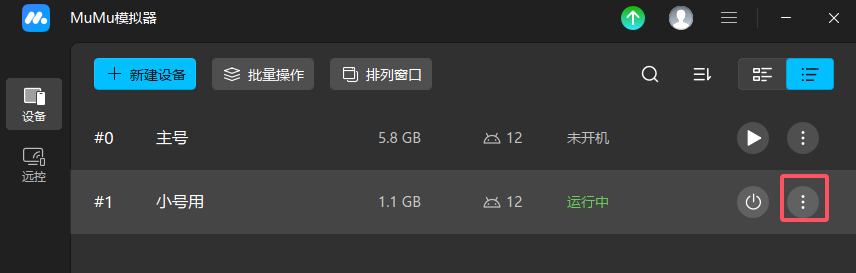
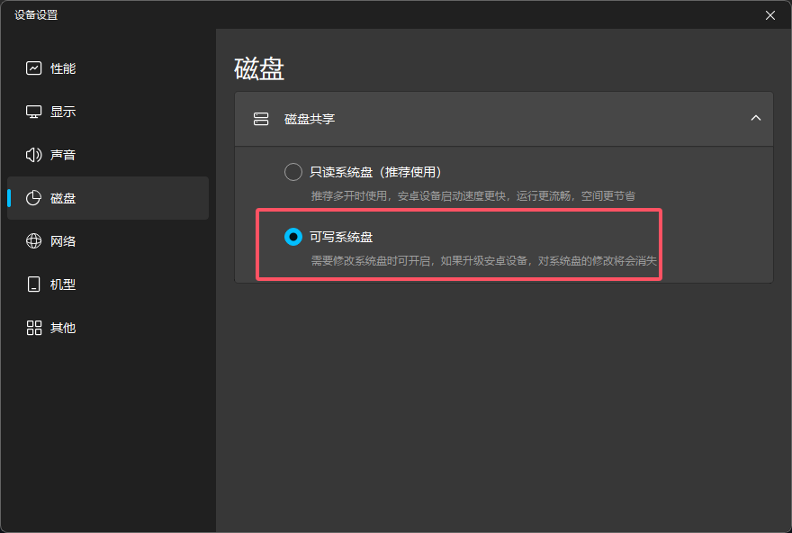
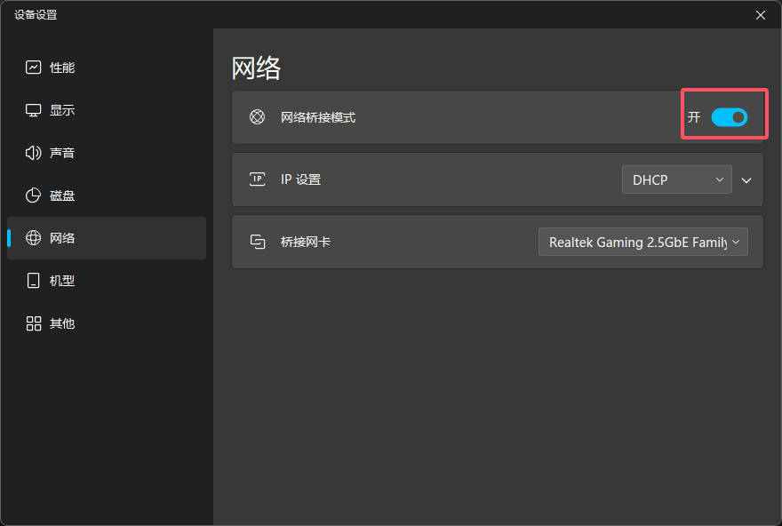
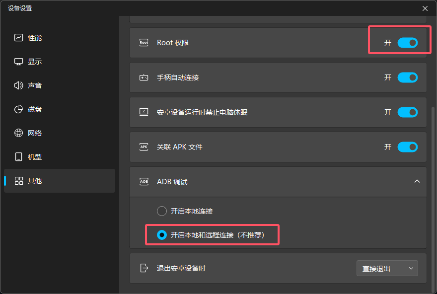

# ADB与网络证书安装指南

> 本文档介绍如何在特别是MuMu模拟上安装网络抓包证书到系统证书目录。

## 📋 目录

- [前置要求](#前置要求)
- [MuMu模拟器配置](#mumu模拟器配置)
- [自动安装证书](#自动安装证书)

---

## 前置要求

在开始之前，请确保满足以下条件：

1. **MuMu模拟器已安装并运行**（版本 ≥ 5.5.0）
2. **MuMu模拟器已开启ADB调试**
3. **MuMu模拟器已开启"可选系统盘"功能**（见下方配置步骤）

> 💡 **说明：** 系统已内置网络抓包CA证书（有效期至2026年11月），可直接使用。

---

## MuMu模拟器配置

### ⚠️ 重要：开启"可选系统盘"功能

这是**最关键**的步骤！如果不开启此功能，证书将无法安装到系统目录。

#### 操作步骤：

**步骤1：打开MuMu模拟器，点击右上角的"更多"按钮（三个点图标）选择设备设置**

**步骤2：在 磁盘 选项中选择"可写系统盘"**

**步骤3：在 网络 中开启网络桥接模式**

**步骤4：在 其他 中 开启ROOT权限与 ADB调试选择为下图所示**

> 💡 **提示：** 开启"可选系统盘"后，系统分区才允许写入操作。必须重启模拟器才能生效！

---

## 自动安装证书

本系统提供了Web界面来自动安装证书，无需手动执行命令。

### 步骤1：访问Dev-Tools页面

1. 启动项目后，访问 `http://localhost:9003`
2. 点击左侧菜单：**其他功能 → 开荒工具 → ADB与网络证书安装**

### 步骤2：扫描并连接设备

**方式一：自动扫描**
- 点击 **"扫描局域网设备"** 按钮
- 系统会自动扫描局域网内的ADB设备
- 等待扫描完成，选择目标设备

**方式二：手动连接**
- 点击 **"手动连接设备"** 按钮
- 输入设备地址（格式：`IP:端口`）
  - 例如：`10.0.0.1:5555`
- 点击连接

### 步骤3：查看设备信息

连接成功后会显示设备详细信息：

- **设备序列号**
- **连接地址**
- **设备型号**
- **Android版本**
- **SDK版本**
- **Root权限状态** ✓/✗

### 步骤4：检查证书状态

系统会自动检测证书安装状态：

- **✓ 已安装** - 证书已存在于系统目录
- **✗ 未安装** - 需要安装证书

### 步骤5：安装证书

1. 点击 **"安装证书"** 按钮
2. 系统会自动执行以下操作：
   - 计算证书的hash值
   - 推送证书到设备临时目录
   - 使用root权限复制到系统证书目录
   - 设置正确的权限（644）
   - 验证安装结果
3. 等待安装完成提示

### 步骤6：重启模拟器

证书安装成功后，**必须重启MuMu模拟器**使证书生效。

---

## 常见问题 FAQ

**Q: 为什么必须开启"可选系统盘"？**

A: MuMu模拟器默认系统分区是只读的，开启"可选系统盘"后才允许写入系统文件。

**Q: 证书安装后需要重启吗？**

A: 是的，必须重启模拟器才能使证书生效。

**Q: 支持其他Android设备吗？**

A: 支持，但需要设备已root且系统分区可写。

**Q: 证书会过期吗？**

A: 会的，证书有有效期。系统内置证书有效期至2026年11月，过期后需要重新安装新证书。

---

**最后更新：** 2025-11-08  
**适用版本：** CsWeaponManager v1.1.10+

