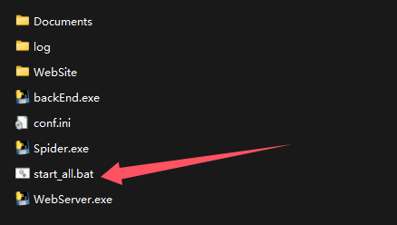

# CS武器管理器 - 首次使用指南

欢迎使用CS武器管理器！本指南将一步步教您如何部署和使用本系统。

---

## 第一步：解压压缩包

下载最新版本的 `CsWeaponManager.zip` 后，解压到任意目录（建议路径不包含中文和空格）。

解压后的目录结构如下：



```
CsWeaponManager/
├── WebSite/             # 前端网站文件
├── backEnd.exe          # 后端服务程序
├── Spider.exe           # 爬虫服务程序
├── WebServer.exe        # 网页服务程序
├── conf.ini             # 配置文件
├── start_all.bat        # 一键启动脚本
└── csweaponmanager.db   # 数据库文件（首次启动后自动生成）
```

---

## 第二步：下载图包

系统需要武器图片资源才能正常显示饰品图片。

**下载地址：** [点击下载图包](https://drive.google.com/file/d/1Jz50N_op51l2xjMPzFX5SKO9rQMNr4nP/view?usp=drive_link)

下载 `weapon_imgs.zip` 后，**解压到项目根目录**，确保目录结构如下：

```
CsWeaponManager/
├── weapon_imgs/         # 武器图片资源文件夹（必需）
│   ├── xxx.png
│   ├── xxx.png
│   └── ...
├── WebSite/
├── backEnd.exe
├── Spider.exe
├── WebServer.exe
├── conf.ini
└── start_all.bat
```

---

## 第三步：启动程序

双击 `start_all.bat` 启动程序。

系统会自动启动三个服务：
- **Spider.exe** - 爬虫服务（后台运行）
- **backEnd.exe** - 后端API服务（后台运行）
- **WebServer.exe** - 网页服务（前台运行）

启动成功后，会显示以下信息：

```
========================================
Services started successfully!
========================================
Backend API: http://localhost:9001
Spider API:  http://localhost:9002
WebSite:     http://localhost:9003
========================================
```

**打开浏览器，访问：** `http://localhost:9003`

---

## 第四步：完成模拟器SSL证书安装

如果您需要使用模拟器（如MuMu模拟器）来运行移动端应用，需要先安装SSL证书。

**详细安装步骤请查看：** [ADB与网络证书安装指南](其他功能/开荒工具/ADB与网络证书安装.md)

### 快速步骤概览：

1. **配置MuMu模拟器**
   - 开启"可写系统盘"功能
   - 开启网络桥接模式
   - 开启ROOT权限和ADB调试

2. **安装证书**
   - 访问系统的 **"其他功能 → 开荒工具 → ADB与网络证书安装"** 页面
   - 扫描或手动连接模拟器设备
   - 点击"安装证书"按钮
   - 重启模拟器使证书生效

**注意：** 系统依赖从模拟器获取的各个APP cookie运行

---

## 第五步：添加数据源

配置数据源后，系统才能从各个平台获取饰品价格和交易数据。

**详细配置步骤请查看：** [数据来源使用指南](其他功能/数据来源/数据来源使用指南.md)

### 快速步骤概览：

1. **访问数据来源页面**
   - 点击左侧菜单：**其他功能 → 数据来源**
   - 或直接访问：`http://localhost:9003/settings/data-source`

2. **创建数据源**
   - 点击"创建第一个数据源"按钮
   - 输入SteamID（用于分组管理）
   - 选择数据源类型

3. **支持的平台**
   - **Steam市场** - 获取库存与steam市场、玩家间交易记录
   - **网易BUFF** - 已完成功能 获取 购买 出售 借贷 租赁记录
   - **悠悠有品** - 已完成功能 获取 购买 出售 借贷 租赁记录
   - **完美世界APP** - 用于获取steam库存组件内的饰品数据
   - **CSFloat** - 获取 购买 出售记录

4. **采集数据**
   - 配置完成后点击"采集"按钮
   - 系统会自动获取平台数据

**注意：** 除Steam市场外，其他平台都需要使用MuMu模拟器配合"一键获取令牌"功能。

---

**祝您使用愉快！如有问题，请查看 [更新日志](updateLog.md) 或提交Issue反馈。**


