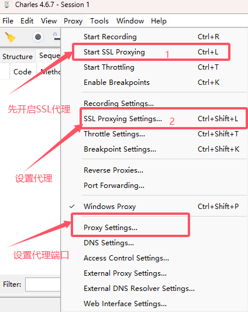
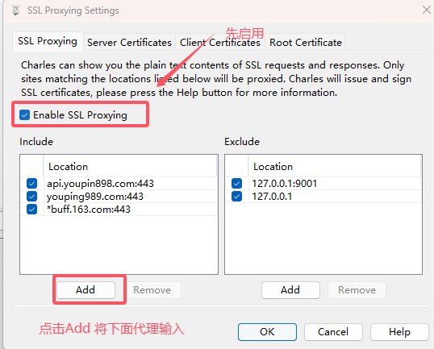
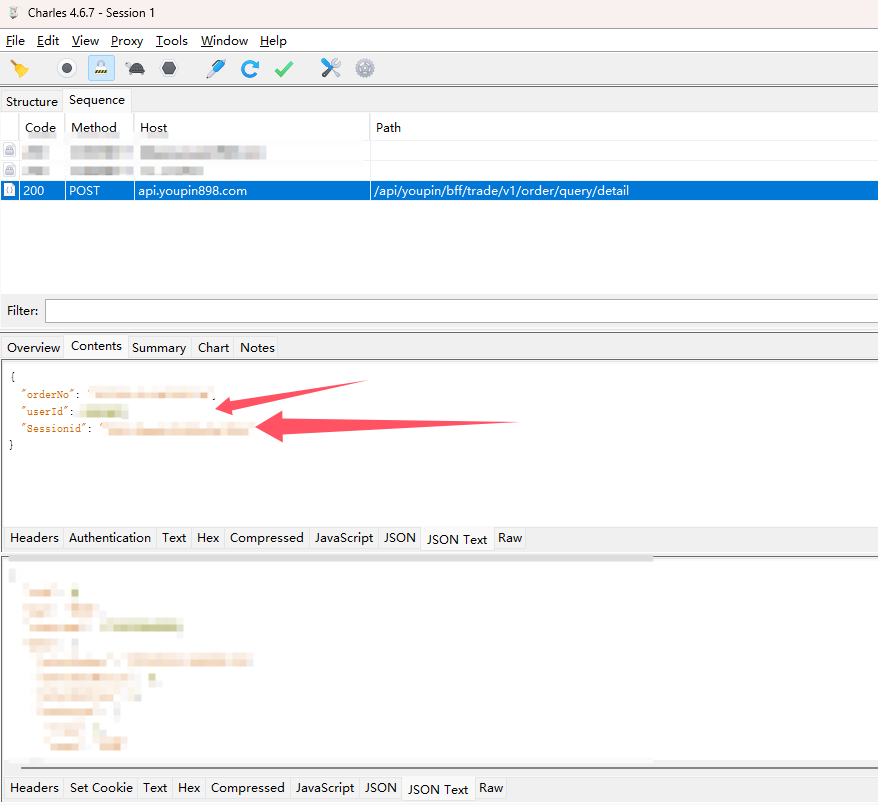
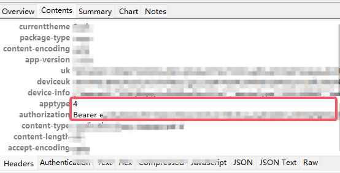

### 添加悠悠有品数据源用法

``` txt
点击数据来源 → 添加新数据源 → 数据源类型 选择悠悠有品 数据源名称填写自己喜欢的
至于展开后需要填写的数据如何获取 这边推荐使用charles进行抓包获取
```





``` txt
host api.youpin898.com
port 443 

接着打开防火墙对应代理端口 安卓手机可以使用V2rayNG IOS手机可以使用Shadowrcket 进行连接 方法不在赘述
确认连接通畅后 点击手机App 点击出售列表 再点击其中随机一件 找到Path = /api/youpin/bff/trade/v1/order/query/detail的数据
```



