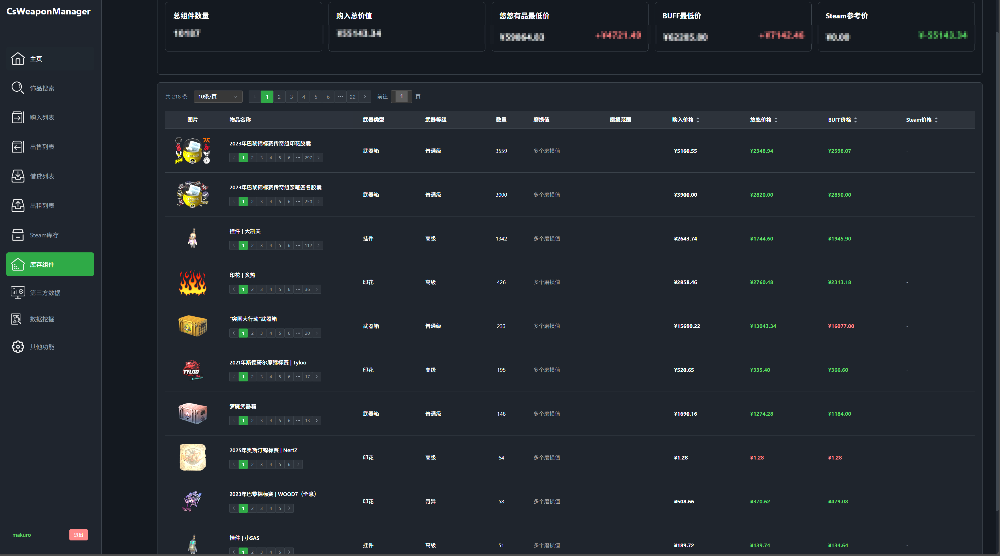
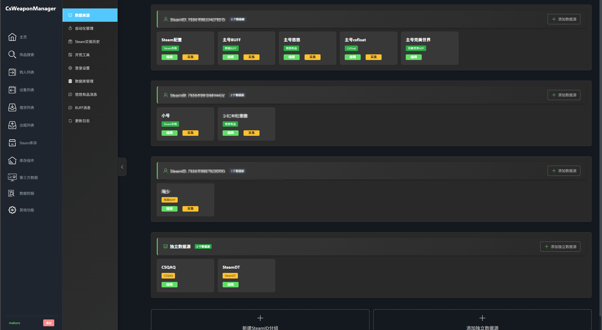

# CS武器管理器 (CS Weapon Manager)

> 一个功能完善的CS2/CSGO饰品交易管理系统，帮助您高效管理Steam饰品的购买、出售、租赁等操作。

## 📝 用前必看
- 需要下载图包：[点击下载](https://drive.google.com/file/d/1Jz50N_op51l2xjMPzFX5SKO9rQMNr4nP/view?usp=drive_link)
- 查看详细的版本更新记录：[更新日志](Documents/updateLog.md)
- 使用指南 : [使用指南](Documents/首次使用指南.md)
- 系统更新方法 ： 1、 点击 其他功能-系统更新-检查更新进行更新
                 2、 将Releases压缩包放在根目录下运行 update.bat
- 本项目不建议部署到公网 目前没有做任何加密传输 可能回造成数据泄露
- 目前只支持 win10 11 win server 2022以上版本运行 不支持LIUNX 

## 📁 项目完整根目录结构

```
CsWeaponManager/
├── Documents/           # 文档目录
├── log/                 # 日志目录（自动生成）
├── weapon_imgs/         # 武器图片资源目录（需从谷歌网盘下载）
├── WebSite/             # 前端网站目录
├── backEnd.exe          # 后端服务可执行文件
├── conf.ini             # 配置文件
├── csweaponmanager.db   # 数据库文件（自动生成）
├── Spider.exe           # 爬虫服务可执行文件
├── start_all.bat        # 一键启动脚本
└── WebServer.exe        # 网页服务可执行文件
``` 

## 📋 项目简介

CS武器管理器是一个集成了多个交易平台的饰品管理系统，支持对Steam库存中的CS2/CSGO饰品进行统一管理和跨平台价格对比。提供直观的Web界面，让您轻松管理饰品交易。

本项目目前正在高速开发中

**支持的平台**
   - **Steam市场** - 获取库存与steam市场、玩家间交易记录
   - **网易BUFF** - 已完成功能 获取 购买 出售 借贷 租赁记录
   - **悠悠有品** - 已完成功能 获取 购买 出售 借贷 租赁记录
   - **完美世界APP** - 用于获取steam库存组件内的饰品数据 操作饰品存放组件功能
   - **CSFloat** - 获取 购买 出售记录

## ⚠️ 重要声明

**本项目仅供学习交流使用，请勿用于商业用途。**

**关于Spider模块说明**：
- Spider爬虫模块涉及APK解包和逆向工程相关技术
- 根据《中华人民共和国数据安全法》和《中华人民共和国个人信息保护法》的相关规定
- Spider模块**不予开源**，仅在本地保留用于个人学习研究
- 本项目开源部分为饰品管理系统的核心功能，不包含任何爬虫或数据采集功能

## ✨ 主要功能

### 🎯 核心功能
- **库存管理** - 实时同步和查看Steam库存饰品
- **购买记录** - 记录和追踪饰品购买信息
- **出售管理** - 管理饰品出售记录和收益
- **租赁系统** - 支持饰品租赁功能
- **价格对比** - 多平台价格实时对比（悠悠有品、BUFF、Steam）
- **数据统计** - 可视化展示交易数据和收益分析
- **库存组件** - Steam库存历史记录查询


## ⚖️ 法律声明与免责条款

### 使用声明
1. **本项目仅供个人学习、研究和交流使用**
2. 使用者应遵守当地法律法规及相关平台的服务条款
3. 禁止将本项目用于任何商业用途
4. 禁止利用本项目进行任何违法违规活动

### 免责声明
1. 使用本项目所产生的一切后果由使用者自行承担
2. 开发者不对使用本项目造成的任何损失负责
3. 本项目不保证数据的准确性和完整性
4. 如有侵权，请联系删除

### Spider模块特别说明
- Spider模块涉及APK逆向工程，根据《中华人民共和国数据安全法》《中华人民共和国个人信息保护法》等相关法律法规，**该模块不予开源**
- 本仓库不包含任何爬虫、数据采集相关代码
- 请使用者通过合法途径获取数据


**再次提醒：本项目仅供学习交流，请合法合规使用！**

## 📸 系统展示

### 主界面


## 购入页面


### 账号库存


### 库存组件内容


### 数据源


