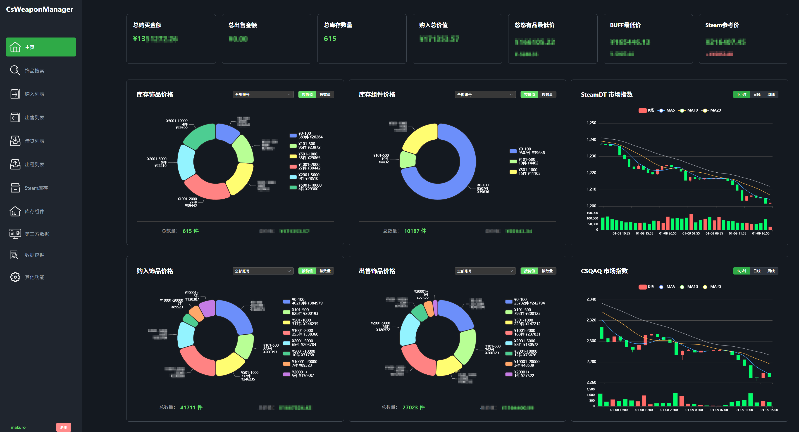
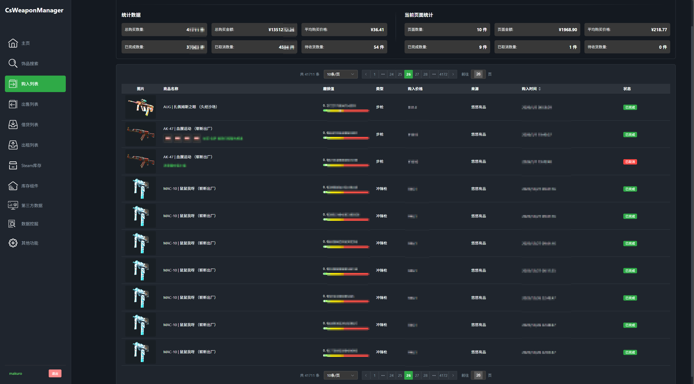
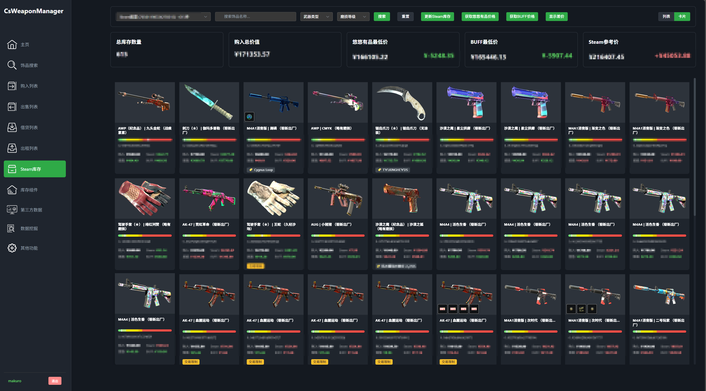

# CS武器管理器 (CS Weapon Manager)

> 一个功能完善的CS2/CSGO饰品交易管理系统，帮助您高效管理Steam饰品的购买、出售、租赁等操作。

## 📋 项目简介

CS武器管理器是一个集成了多个交易平台的饰品管理系统，支持对Steam库存中的CS2/CSGO饰品进行统一管理和跨平台价格对比。提供直观的Web界面，让您轻松管理饰品交易。

本项目目前正在高速开发中

### 🚀 技术栈升级 (2024-12)
- ✅ 前端已迁移至 **Vite** 构建工具
- ✅ 使用 **Vue 3** + **Element Plus**
- ✅ 开发服务器启动速度提升 10倍+
- ✅ 热更新几乎即时响应
- ✅ 安全漏洞从 11个 降至 **0个**

## 📝 更新日志

查看详细的版本更新记录：[更新日志](Documents/updateLog.md)

## ⚠️ 重要声明

**本项目仅供学习交流使用，请勿用于商业用途。**

**关于Spider模块说明**：
- Spider爬虫模块涉及APK解包和逆向工程相关技术
- 根据《中华人民共和国数据安全法》和《中华人民共和国个人信息保护法》的相关规定
- Spider模块**不予开源**，仅在本地保留用于个人学习研究
- 本项目开源部分为饰品管理系统的核心功能，不包含任何爬虫或数据采集功能

## ✨ 主要功能

### 🎯 核心功能
- **库存管理** - 实时同步和查看Steam库存饰品
- **购买记录** - 记录和追踪饰品购买信息
- **出售管理** - 管理饰品出售记录和收益
- **租赁系统** - 支持饰品租赁功能
- **价格对比** - 多平台价格实时对比（悠悠有品、BUFF、Steam）
- **数据统计** - 可视化展示交易数据和收益分析
- **库存组件** - Steam库存历史记录查询

### 🔌 支持平台
- **Steam市场** - Steam官方市场集成
- **悠悠有品 (youpin898)** - 国内主流交易平台
- **BUFF163** - 网易BUFF饰品交易平台
- **完美世界** - 完美世界平台支持

## 📝 配置说明

### 代理设置
系统支持HTTP和SOCKS5代理，用于访问Steam等国际平台：

```ini
[http_proxy]
true = True
host = 127.0.0.1
port = 10811

[socks5]
host = 127.0.0.1
port = 10808
```

### 日志配置
```ini
[LogLevel]
level = error        # 日志级别: debug/info/warning/error
sometime = 14        # 日志保留天数
```

## ⚠️ 注意事项

1. **Cookie配置**: 需要在数据源页面配置各平台的Cookie才能正常使用
2. **代理设置**: 访问Steam需要配置代理
3. **数据备份**: 定期备份 `csweaponmanager.db` 数据库文件
4. **日志文件**: 日志文件位于 `backEnd/log/` 目录

## 🤝 贡献

欢迎提交Issue和Pull Request！

## ⚖️ 法律声明与免责条款

### 使用声明
1. **本项目仅供个人学习、研究和交流使用**
2. 使用者应遵守当地法律法规及相关平台的服务条款
3. 禁止将本项目用于任何商业用途
4. 禁止利用本项目进行任何违法违规活动

### 免责声明
1. 使用本项目所产生的一切后果由使用者自行承担
2. 开发者不对使用本项目造成的任何损失负责
3. 本项目不保证数据的准确性和完整性
4. 如有侵权，请联系删除

### Spider模块特别说明
- Spider模块涉及APK逆向工程，根据《中华人民共和国数据安全法》《中华人民共和国个人信息保护法》等相关法律法规，**该模块不予开源**
- 本仓库不包含任何爬虫、数据采集相关代码
- 请使用者通过合法途径获取数据

## 📄 许可证

本项目采用学习交流许可，不得用于商业用途。

## 📮 联系方式

如有问题或建议，欢迎通过以下方式联系：

- Issues: [项目Issues页面]

---

⭐ 如果这个项目对您有帮助，欢迎Star支持！

**再次提醒：本项目仅供学习交流，请合法合规使用！**

## 📸 系统展示

### 主界面


### 功能模块


### 数据统计


